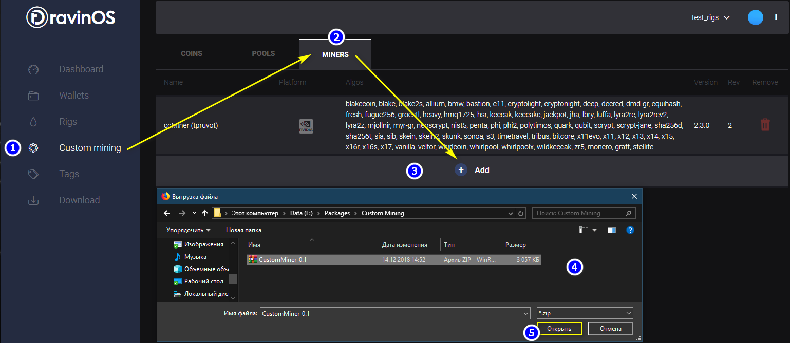
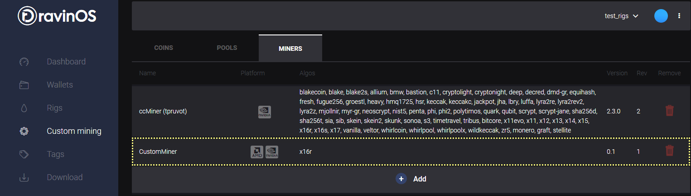
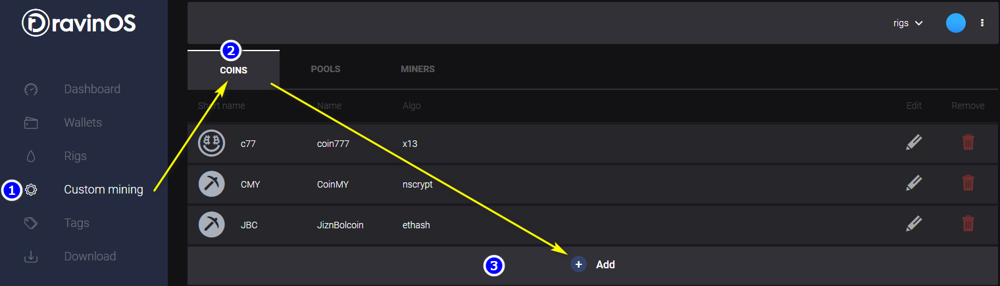
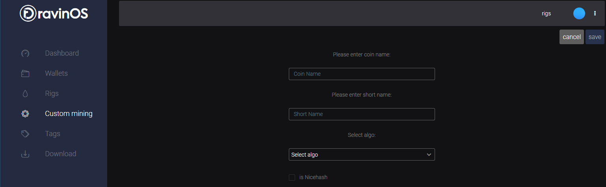
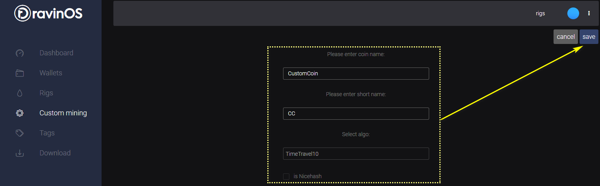
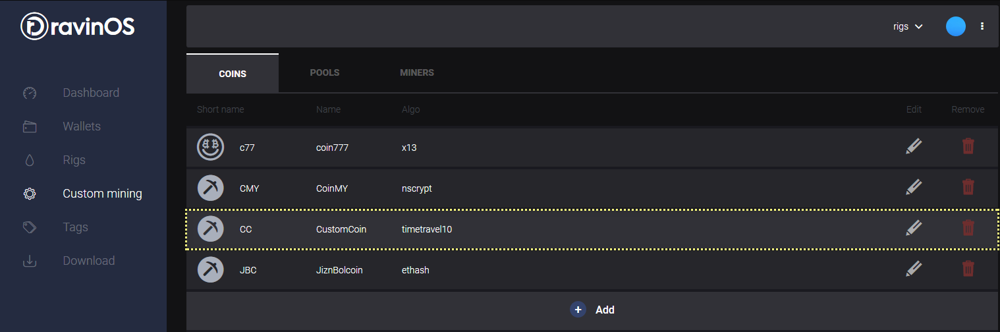
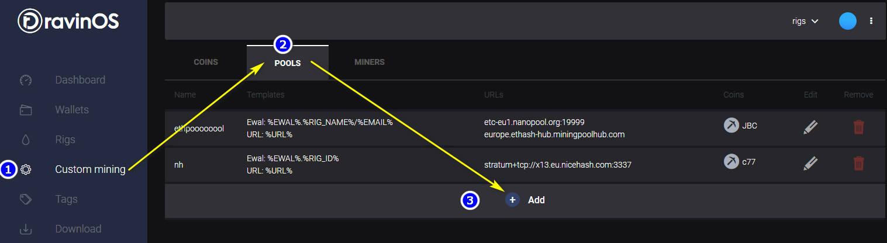
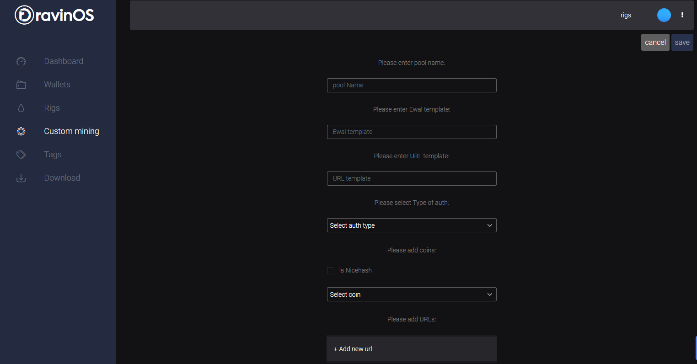
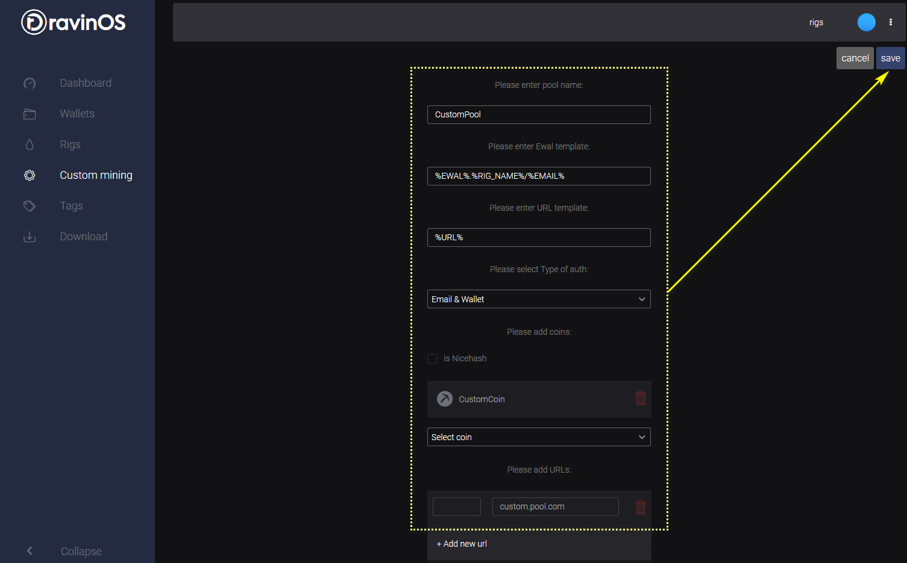
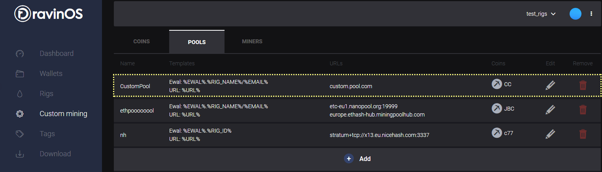

## Использование Custom mining в RavinOS.

Система *RavinOS* позволяет использовать сторонние алгоритмы для майнинга и
добычи кастомных монет. Для использования фунционала Custom Mining пользователю
необходимы:

1.  ZIP архив с майнером, включающий в себя:

- файлы майнера

- каталог **RAVINOS** c файлом конфигурации пакета майнера **manifest.json** и двумя файлами скрипта на языке **python** (**start.py** и **stats.py**).

Структура файлов подробнее – в соответствующем разделе.

2.  Данные монеты: алгоритм и тип

3.  Данные пула:

-   Шаблон адреса пула

-   Тип авторизации на пуле

-   Данные для авторизации на пуле (адрес, Порт, Кошелек, имя пользователя,
    пароль и т д.)

Добавление Custom Miner
=======================

Файлы каталога RAVINOS
----------------------

### Файл конфигурации пакета майнера **manifest.json**

```json
{
  "package":"nbminer-21.0",
  "name": "NBMiner",
  "version": "21.0",
  "description": "NBMiner 21.0",
  "maintainer":"RavinOS (dev@ravinos.com)",
  "platforms": ["nvidia"],
  "dual_coin": false,
  "algo": ["cuckaroo29", "ethash", "daggerhashimoto", "tensority", "cuckaroo31", "cuckoo"],
  "executable": ["nbminer"],
  "rev":1
}
```
Описание параметров конфигурации:
```GO
{  
    "package":"",           // Имя пакета (должно совпадать с именем ZIP архива)  
    "name": "",             // Название майнера  
    "version": "",          // Версия майнера  
    "description": "",      // Описание пакета  
    "maintainer":"",        // Информация о создателе пакета  
    "platforms": ["",…,""], // Поддерживаемые платформы  
    "dual_coin": bool,      // Поддержка второй монеты  
    "algo": ["",…,""],      // Поддерживаемые алгоритмы  
    "executable": [""],     // Наименование исполняемого файла  
    "rev":int               // Версия пакета  
}
```

### Скрипт запуска **start.py**

```python
import ravinos
cfg = ravinos.get_config()  
...
YOUR CODE HERE
...  
ravinos.run(commandline)
```

**ravinos.get_config** функция возвращает объект конфигурации задачи для 
майнера, на основании указанных в системе параметров.
```GO
{
  "coins": [                        // Массив монет (index=0 - Primary, index=1 - Secondary (если есть)
      "coin_id" : int,              //
      "pools": [                    // Массив пулов
          "url": string,            // Адрес пула
          "user": string,           // Имя пользователя
          "password": string,       // Пароль пула
          "pool_type": int,         // Тип пула
      ],
  "algo": string,                   // Алгоритм монеты
  ],
  "work_dir": string,               // Текущая рабочая директория
  "miner_dir": string,              // Директория майнера
  "args": string,                   // Дополнительные аргументы командной строки
  "api_port": uint32,               // Доступный порт для API майнера
  "log_file":string,                // Путь к лог-файлу
  "mpus": [                         // Массив MPU (miner process unit)
  "id":int32,                       // Порядковый номер MPU по шине PCI (начинается с 0)
  "id_by_type":int32,               // Порядковый номер по типу устройства (AMD, NVIDIA)(начинается с 0)
  "openl_id":int32,                 // Порядковый номер по OpenCL (начинается с 0)
  "opencl_id_by_platform":int32,    // Порядковый номер по платформе OpenCL (AMD, NVIDIA) (начинается с 0)
  "pci_id":int32,                   // BUS ID
  "pci": string,                    // BUS ID (строка) 01:00.0
  "type":string,                    // Тип MPU (AMD, NVIDIA)
  "name":string,                    // Название MPU
  "memory":string,                  // Тип чипа памяти MPU (AMD)
  "memory_size":int64,              // Доступный размер памяти MPU
  ],
  "platform":string,                //
  "user_config,omitempty":string,   // Контент пользовательского файла конфигурации
  "intensity,omitempty":string,     // Интенсивность (указывается согласно настройкам майнера)
}
```

**ravinos.run** запускает сформированную пользователем строку на исполнение

### Скрипт получения статистики **stats.py**

Пример получения статистики raw socket **ro.get_socket_data** или web
**ro.get_http_data**:

```python
import ravinos  
stats = ro.get_stats()  
ravinos.get_socket_data(stats[‘api_port’], ‘some_command’)
...
YOUR CODE HERE
...  
ravinos.set_stats(stats)
```
*ИЛИ*
```python
import ravinos  
stats = ro.get_stats()  
ravinos.get_http_data(‘url’)
...
YOUR CODE HERE
...  
ravinos.set_stats(stats)
```
**ravinos.get_stats** функция получает объект статистики, который необходимо
вернуть в функцию **ravinos.set_stats**:
```GO
{
    "mpu":[
        "id":int32,                     // Порядковый номер MPU по шине PCI (начинается с 0)
        "id_by_type":int32,             // Порядковый номер по типу устройства (AMD, NVIDIA)(начинается с 0)
        "openl_id":int32,               // Порядковый номер по OpenCL (начинается с 0)
        "opencl_id_by_platform":int32,  // Порядковый номер по платформе OpenCL (AMD, NVIDIA) (начинается с 0)
        "pci_id":int32,                 // BUS ID
        "pci": string,                  // BUS ID (строка) 01:00.0
        "type":string,                  // Тип MPU (AMD, NVIDIA)
        "hash_rate1":float64,           // хешрейт первой монеты
        "hash_rate2":float64,           // хешрейт второй монеты (если есть)
        "temp,omitempty":int32,
    ]
    "fans,omitempty":[
        "percent":int32,
        "rpm":int32,
    ]
    "errors":[]string,                  // массив ошибок
    "log_file":string,                  //
    "last_log_file_size":int64,         //
    "have_driver_error":bool,           //
    "api_port":uint32,                  // Доступный порт для API майнера
}
```
**ravinos.get_socket_data** функция позволяет получить данные напрямую из сокета
(в формате майнера). Принимает 2 параметра: порт API и команда для получения
статистики (в формате майнера).

**ravinos.get_http_data** функция позволяет получить данные по http протоколу (в
формате майнера). Принимает 1 параметр: URL статистики.

**ravinos.set_stats** функция принимает, сформированный кодом пользователя,
объект статистики и передает его в систему.

Формирование ZIP архива
-----------------------

Формирование ZIP архива доступно любыми удобными пользователю средствами.
Структура архива:

    /RAVINOS

        /manifest.json

        /start.py

        /stats.py

    /*miner_files*

Интеграция Custom miner архива в систему RavinOS
------------------------------------------------

После того как архив сформирован и все необходимые данные известны можно
переходит к непосредственному добавлению майнера в систему RavinOS. Для этого
необходимо:

1.  В меню слева выбрать пункт **Custom mining**

2.  Перейти на вкладку **MINERS**

3.  Нажать **Add**

4.  В открывшемся окне проводника выбрать ранее сформированный **zip** архив

5.  Нажать **Открыть**



6.  Подтвердить добавление архива

    

Если все сделано верно, то новый добавленный майнер отобразится в списке на
текущей вкладке.



Добавление Custom Coin
======================

Для добавления Custom Coin (кастомной монеты):

1.  В меню слева выбрать пункт **Custom mining**

2.  Перейти на вкладку **COINS**

3.  Нажать **Add**



1.  В открывшейся форме заполнить данные:

    -   Coin Name // наименование монеты

    -   Short Name // сокращение имени монеты

    -   Select algo // выбор алгоритма монеты

    -   Is Nicehash // флаг для Nicehash монет



1.  Нажать **Save** (станет активной после заполнения формы)



Если все сделано верно, то новая монета отобразится в списке на текущей вкладке.



Добавление Custom Pool
======================

Для добавления Custom Pool (кастомного пула):

1.  В меню слева выбрать пункт **Custom mining**

2.  Перейти на вкладку **POOLS**

3.  Нажать **Add**



1.  В открывшейся форме заполнить данные:

    -   pool Name // наименование пула

    -   Ewal template // шаблон кошелька

    -   URL template // шаблон URL

    -   Select auth type // выбор типа авторизации на пуле

    -   Is Nicehash // указание типа сервера nicehash

    -   Select coin // выбор монет(ы)

    -   Add new url // добавление URL



1.  Нажать **Save** (станет активной после заполнения формы)



Если все сделано верно, то новый пул отобразится в списке на текущей вкладке.


